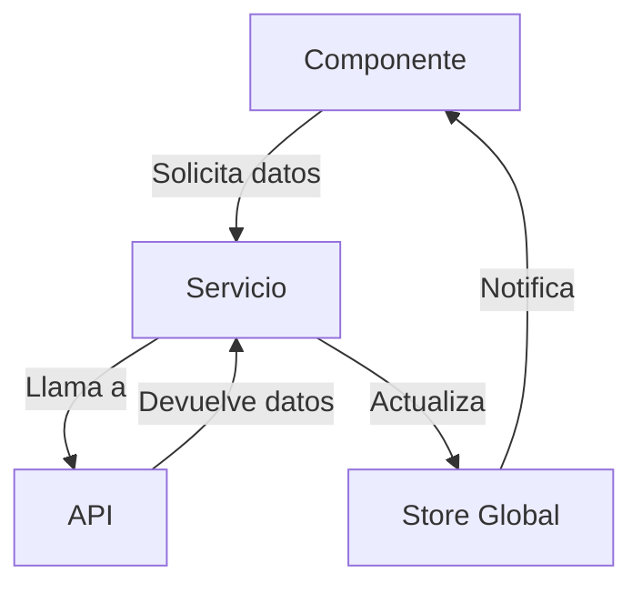

# Sistema y Filosofía de Desarrollo

Este documento explica la arquitectura, patrones de diseño y filosofía detrás del boilerplate para garantizar un desarrollo consistente y mantenible.

## Mentalidad de Desarrollo

### 1. Tipado Estricto
- **TypeScript First**: Todo el código debe estar completamente tipado.
- **Interfaces Explícitas**: Define interfaces para todas las estructuras de datos.
- **Evita `any`**: Usa tipos específicos o `unknown` cuando sea necesario.

### 2. Componentes React
- **Componentes Pequeños**: Cada componente debe tener una única responsabilidad.
- **Props Inmutables**: No modificar las props directamente.
- **Composición sobre Herencia**: Prefiere la composición de componentes.

### 3. Gestión de Estado
- **Local Primero**: Usa el estado local cuando solo un componente lo necesita.
- **Contexto para Datos Globales**: Usa Zustand para estado global compartido.
- **React Query para Datos del Servidor**: Maneja el estado del servidor con React Query.

## Arquitectura

### 1. Estructura de Carpetas
```
src/
├── app/            # Rutas de la aplicación (App Router de Next.js)
├── components/     # Componentes reutilizables
│   ├── ui/        # Componentes de UI puros
│   └── features/  # Componentes con lógica de negocio
├── hooks/         # Custom hooks
├── lib/           # Utilidades y configuraciones
├── services/      # Llamadas a APIs y lógica de negocio
└── store/         # Estado global con Zustand
```

### 2. Flujo de Datos



## Manejo de Datos

### 1. React Query (TanStack Query)
- **Claves de Consulta**: Usa claves descriptivas para las consultas.
- **Reintentos Automáticos**: Aprovecha el manejo de errores incorporado.
- **Paginación Infinita**: Usa `useInfiniteQuery` para listas grandes.

```typescript
// Ejemplo de consulta con React Query
const { data, isLoading, error } = useQuery({
  queryKey: ['todos', { status: 'active' }],
  queryFn: () => fetchTodos({ status: 'active' }),
  staleTime: 5 * 60 * 1000, // 5 minutos
});
```

### 2. Mutaciones
- **Optimistic Updates**: Actualiza la UI antes de recibir respuesta del servidor.
- **Revalidación**: Invalida consultas relacionadas después de mutaciones.

```typescript
const mutation = useMutation({
  mutationFn: updateTodo,
  onMutate: async (newTodo) => {
    // Cancelar consultas actuales
    await queryClient.cancelQueries({ queryKey: ['todos'] });
    
    // Snapshot del valor anterior
    const previousTodos = queryClient.getQueryData(['todos']);
    
    // Actualización optimista
    queryClient.setQueryData(['todos'], (old) => [...old, newTodo]);
    
    return { previousTodos };
  },
  onError: (err, newTodo, context) => {
    // Revertir en caso de error
    queryClient.setQueryData(['todos'], context.previousTodos);
  },
  onSettled: () => {
    // Revalidar después de la mutación
    queryClient.invalidateQueries({ queryKey: ['todos'] });
  },
});
```

## Estilos y Diseño

### 1. Tailwind CSS
- **Utilidades**: Usa clases de utilidad de Tailwind en lugar de CSS personalizado.
- **@apply**: Solo para estilos reutilizables.
- **Variables CSS**: Define colores y tamaños en `tailwind.config.js`.

### 2. Diseño Responsivo
- **Mobile First**: Desarrolla primero para móviles y luego usa breakpoints.
- **Tailwind Breakpoints**: Usa los prefijos `sm:`, `md:`, `lg:`, etc.

## Testing

### 1. Pruebas Unitarias (opcional pero recomendado)
- **Jest + Testing Library**: Para pruebas de componentes.
- **Mocks**: Usa mocks para dependencias externas.

### 2. Pruebas de Integración (opcional pero recomendado)
- **Cypress**: Para pruebas E2E.
- **MSW**: Para simular APIs en pruebas.

## Flujo de Trabajo Git

1. **Ramas**: Usa ramas descriptivas (ej: `feature/add-login`).
2. **Commits**: Mensajes claros y descriptivos.
3. **Pull Requests**: Revisión de código obligatoria.
4. **CI/CD**: Integración continua con pruebas automáticas.

## Despliegue

### 1. Variables de Entorno
- Usa `.env.local` para desarrollo.
- Configura secretos en la plataforma de despliegue.

### 2. Optimizaciones
- **Imágenes**: Usa el componente `next/image`.
- **Código**: Code splitting automático con Next.js.
- **Bundle**: Analiza el bundle con `@next/bundle-analyzer`.

## Recursos Adicionales

- [Documentación de Next.js](https://nextjs.org/docs)
- [Documentación de React Query](https://tanstack.com/query/latest)
- [Documentación de Zustand](https://docs.pmnd.rs/zustand/)
- [Guía de Estilo de Airbnb](https://github.com/airbnb/javascript)

## Conclusión

Este boilerplate está diseñado para ser escalable, mantenible y productivo. Sigue estas pautas para mantener la consistencia del código y aprovechar al máximo las herramientas proporcionadas.

¿Tienes preguntas o sugerencias? ¡Abre un issue en el repositorio!